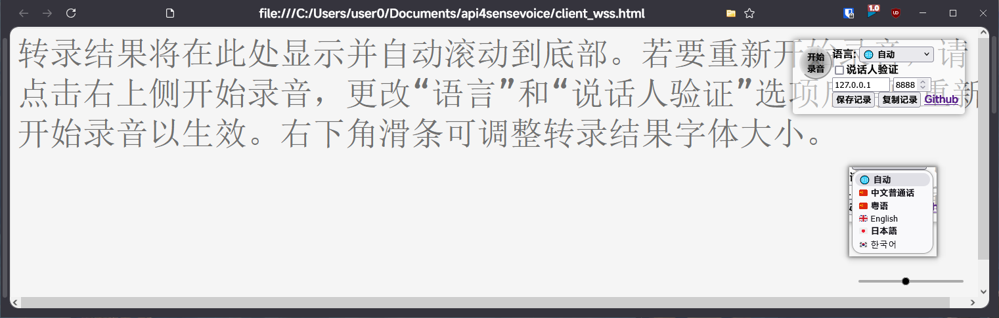

## real-time streaming sensevoice with speaker verification


It has inherited some enhanced features for sensevoice:
- **VAD detection**
- **real-time streaming recognition**
- **speaker verification**.


## Update Log

#### 2024-10-31

1. New web_client.
    > 
    > 1. The interface is simple, and the transcription results will automatically scroll to the bottom of the page when there are updates.
    > 2. More settings can be displayed by moving the cursor to the record button in the upper right corner.
    > 3. The language selection has been changed to a dropdown menu.
    > 4. Added settings for the server IP and port.
    > 5. The font size of the transcription results can be adjusted by dragging the slider in the lower right corner.
    > 6. The transcription results have been changed to an editable text box style.
    > 7. Added a hyperlink to the GitHub project.
    > 8. Implement internal sound recording without microphone sound using Voicemeeter software, and adjust the browser window transparency with SmartSystemMenu software.
    > 

#### 2024-09-30

1. Optimized speaker verification processing by accumulating audio data to improve recognition accuracy.
2. Added `logprob` to the recognition results to represent the confidence of the recognition, for use by upper-level applications.


## Installation

First, clone this repository to your local machine:

```bash
git clone https://github.com/0x5446/api4sensevoice.git
cd api4sensevoice
```

Then, install the required dependencies using the following command: 

```bash
conda create -n api4sensevoice python=3.10
conda activate api4sensevoice

conda install -c conda-forge ffmpeg

pip install -r requirements.txt
```

## Running

### Single Sentence Recognition API Server

```python
if __name__ == "__main__":
    parser = argparse.ArgumentParser(description="Run the FastAPI app with a specified port.")
    parser.add_argument('--port', type=int, default=7000, help='Port number to run the FastAPI app on.')
    parser.add_argument('--certfile', type=str, default='path_to_your_certfile', help='SSL certificate file')
    parser.add_argument('--keyfile', type=str, default='path_to_your_keyfile', help='SSL key file')
    args = parser.parse_args()
    
    uvicorn.run(app, host="0.0.0.0", port=args.port, ssl_certfile=args.certfile, ssl_keyfile=args.keyfile)
```
The above code is from the end of server.py. You can modify it to define the port, certfile, and keyfile, then directly run python server.py to start the API service.

You can also set these through command-line arguments, for example:

```bash
python server.py --port 8888 --certfile path_to_your_certfile --keyfile path_to_your_key
```

#### API Description

##### Transcribe Audio

- Path: `/transcribe`
- Method: `POST`
- Summary: Transcribe audio
- Request Body:
  - `multipart/form-data`
  - Parameters:
    - `file` (required): The audio file to transcribe
- Response: 
  - 200 Success
  - Content Type: `application/json`
  - Schema:
    - `code` (integer): state number
    - `info` (string): meta info
    - `data` (object): Response object

- Request Example:

```bash
curl -X 'POST'  
  'http://yourapiaddress/transcribe'  
  -H 'accept: application/json'  
  -H 'Content-Type: multipart/form-data'  
  -F 'file=@path_to_your_audio_file'
```

- Response Example (200 Success):

```json
{
  "code": 0,
  "msg": "Success",
  "data": {
    // Transcription result
  }
}
```


### Streaming Real-time Recognition WebSocket Server

```python
if __name__ == "__main__":
    parser = argparse.ArgumentParser(description="Run the FastAPI app with a specified port.")
    parser.add_argument('--port', type=int, default=27000, help='Port number to run the FastAPI app on.')
    parser.add_argument('--certfile', type=str, default='path_to_your_certfile', help='SSL certificate file')
    parser.add_argument('--keyfile', type=str, default='path_to_your_keyfile', help='SSL key file')
    args = parser.parse_args()

    uvicorn.run(app, host="0.0.0.0", port=args.port, ssl_certfile=args.certfile, ssl_keyfile=args.keyfile)
```
The above code is from the end of server_wss.py. You can modify it to define the port, certfile, and keyfile, then directly run python server_wss.py to start the WebSocket service.

You can also set these through command-line arguments, for example:

```bash
python server_wss.py --port 8888 --certfile path_to_your_certfile --keyfile path_to_your_key
```

If you want to enable speaker verification:

1. Prepare the voice audio files of the speakers to be verified: 16000 sampling rate, single channel, 16-bit width, WAV format, and place them in the speaker directory.
2. Modify the following part of server_wss.py to replace the file paths in the list with your own (you can add multiple, any match will be considered as verification passed, and ASR inference will proceed).
```python
reg_spks_files = [
    "speaker/speaker1_a_cn_16k.wav"
]
```

#### WebSocket Parameters
- Endpoint: /ws/transcribe
- Query Parameters:
  - sv：Whether to enable speaker verification
    - Optional
    - Default value: 0
- Upstream data: PCM binary
  - channel number: 1
  - sample rate: 16000
  - sample deepth: 16bit
- Downstream data: Json String
  - Schema:
    - `code` (integer): state number
    - `info` (string): meta info
    - `data` (object): Response object

#### Client Testing Page

- `client_wss.html`
- Change `wsUrl` to your own WebSocket server address to test
```javascript
ws = new WebSocket(`wss://your_wss_server_address/ws/transcribe${sv ? '?sv=1' : ''}`);
```

## Roadmap

- [x]  Single sentence recognition (suitable for short segments of speech)
- [x]  Streaming real-time recognition
- [x]  Streaming real-time recognition with speaker verification
- [ ]  Latency optimization

## Contribution

All forms of contributions are welcome, including but not limited to:

- Reporting bugs
- Requesting features
- Submitting code improvements
- Updating documentation

## License

This project is licensed under the [MIT License](https://opensource.org/license/mit). See the LICENSE file for details.

## Dependencies
- [https://github.com/FunAudioLLM/SenseVoice](https://github.com/FunAudioLLM/SenseVoice)
- [https://modelscope.cn/models/iic/speech_campplus_sv_zh_en_16k-common_advanced](https://modelscope.cn/models/iic/speech_campplus_sv_zh_en_16k-common_advanced)
- [https://modelscope.cn/models/iic/speech_fsmn_vad_zh-cn-16k-common-pytorch](https://modelscope.cn/models/iic/speech_fsmn_vad_zh-cn-16k-common-pytorch)
